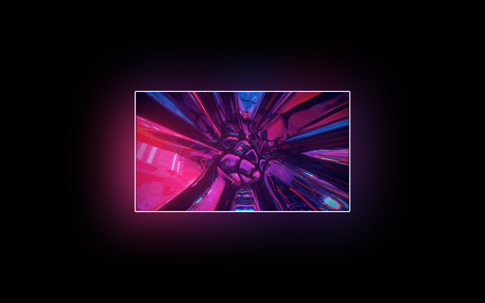

# Tailwind Ambient Mode Example

This project showcases a minimalist video background glow, inspired by YouTube's ambient mode. It's designed using Tailwind CSS and built on Sveltekit, although Sveltekit is not a prerequisite.

This isn't plugin, I'm just showing how it can be done.



## Prerequisites

Ensure you have the latest version of npm installed.

## Installation & Setup

1. Clone the repository to your local machine.
2. Navigate to the project directory.
3. Install the required dependencies:

```bash
npm i
```

## Development

Start the development server with:

```bash
npm run dev
```

## Acknowledgments

- Inspired by YouTube's ambient mode
- Built with Tailwind CSS and Sveltekit
